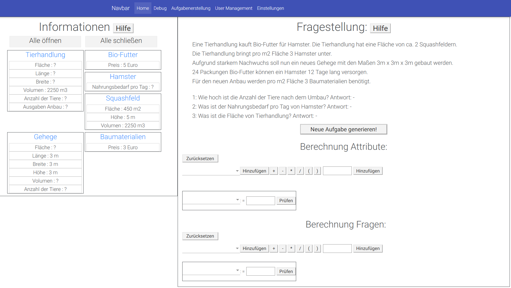
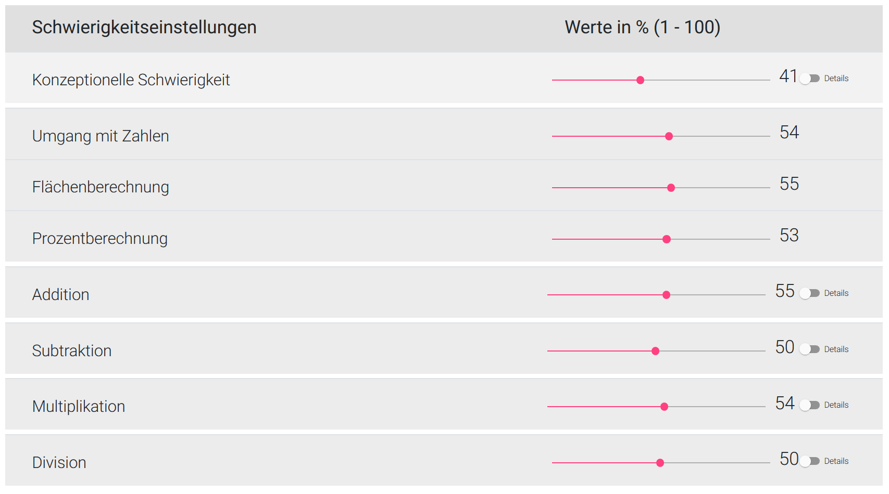

# What it is
I implemented a WebService of a learning platform that generates mathematical word problems and adjusts its difficulties dynamically for my master thesis in Computer Science

# How it works

The learning platform uses a thorough logging system to track the behaviour of the student solving mathematical word problems. The data is then used to update a student model that represents the expertise of the student in various skills, such as "Area Measurement" "Percent and Interest Calculation" and so on. These skills are translated into difficulty parameters on runtime, which determine how the word problem is generated. The word problem is iteratively constructed by adding compatible templates together. These templates have object and number placeholders. The object placeholders are filled by suitable objects that are stored in a database and were previously extracted from the semantic web e.g. an object of the type *City* can be represented by multiple cities such ass Bremerhaven, Lilienthal, Hude and so on, each with different numerical values. The choice is determined by the student specific difficulty parameters.

For more information read the masterthesis that is included in this repository.

# Technologies used:

## Frameworks

* Spring Boot (REST-API)
* Angular7
* Hibernate/JDBC/MySQL
## Tools

* FindBugs
* PMD
* Checkstyle
* Sonarcube

# Demo

## Overview of the system

## Difficulty settings

